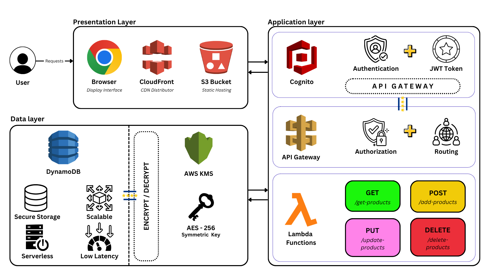

# The Diagon Alley

A cloud-native, serverless e-commerce platform built on AWS that enables customers to browse products, search inventory, manage shopping carts, and place orders through a modern web application. The platform leverages fully managed AWS services and Infrastructure as Code (IaC) to deliver scalability, reliability, security, and operational efficiency without managing traditional servers.

---

## Overview

The Diagon Alley is a full-stack serverless marketplace designed to demonstrate modern cloud architecture and enterprise software engineering practices.

The application provides a complete shopping experience through a React-based frontend and a collection of AWS Lambda-powered backend services exposed through Amazon API Gateway. Product data, shopping carts, and order information are stored in Amazon DynamoDB. Amazon Cognito handles user authentication and endpoint authorization. Terraform is used to provision and manage the entire cloud infrastructure.

The project showcases how modern e-commerce systems can be built using event-driven and serverless design principles while maintaining high availability, automatic scalability, and low operational overhead.

---

## Key Features

### Product Catalog Management

- Browse available products
- View product details
- Manage inventory information
- Product creation, updates, and deletion

### Product Search

- Search products across the catalog
- Fast product discovery
- Optimized search experience

### Shopping Cart Management

- Add products to cart
- Remove products from cart
- Update product quantities
- View cart summary

### Order Processing

- Create and manage orders
- Store order information
- Event-driven order workflows
- Notification integration

### Identity and Authentication

- Secure user registration and verification
- Token-based API Gateway endpoint authorization
- Role-based separation of administrator and customer accounts

### Fully Serverless Deployment

- No server management
- Automatic scaling
- High availability
- Cost-efficient architecture

### Infrastructure as Code

- Complete cloud provisioning using Terraform
- Modular infrastructure design
- Repeatable and consistent deployments

---

## System Architecture



The application follows a serverless architecture built entirely on AWS managed services.

```mermaid
graph TD
    Client[React Frontend / Client] -->|HTTPS Requests| CloudFront[Amazon CloudFront]
    CloudFront -->|Static Files / SPA| S3[Amazon S3]
    Client -->|API Calls / Auth| APIGateway[Amazon API Gateway Stage: prod]
    
    subgraph Authentication
        APIGateway -->|Cognito Authorizer| CognitoPool[Amazon Cognito User Pool]
        CognitoPool -->|Validates JWT| APIGateway
    end

    subgraph Observability [AWS Observability Framework]
        APIGateway -->|API GW Access Logs| CWLogs[CloudWatch Logs / Metric Filters]
        APIGateway -->|End-to-End Tracing| XRay[AWS X-Ray Group: EcommerceApplication]
    end

    subgraph Microservices [AWS Lambda Functions]
        APIGateway -.->|Routes Request| UsersService[Users Lambda]
        APIGateway -.->|Routes Request| ProductService[Product Lambda]
        APIGateway -.->|Routes Request| SearchService[Search Lambda]
        APIGateway -.->|Routes Request| CartService[Cart Lambda]
        APIGateway -.->|Routes Request| OrderService[Order Lambda]
        APIGateway -.->|Routes Request| EasterEggService[EasterEgg Lambda]
        
        UsersService -.->|Active Tracing & Logs| XRay
        ProductService -.->|Active Tracing & Logs| XRay
        SearchService -.->|Active Tracing & Logs| XRay
        CartService -.->|Active Tracing & Logs| XRay
        OrderService -.->|Active Tracing & Logs| XRay
        EasterEggService -.->|Active Tracing & Logs| XRay

        UsersService -.->|Structured Exec Logs| CWLogs
        ProductService -.->|Structured Exec Logs| CWLogs
        SearchService -.->|Structured Exec Logs| CWLogs
        CartService -.->|Structured Exec Logs| CWLogs
        OrderService -.->|Structured Exec Logs| CWLogs
        EasterEggService -.->|Structured Exec Logs| CWLogs
    end

    subgraph Database [Storage & Event Pub/Sub]
        UsersService -->|Read/Write| UsersTable[(DynamoDB Users Table)]
        ProductService -->|Read/Write| ProductTable[(DynamoDB Product Table)]
        CartService -->|Read/Write| CartTable[(DynamoDB Cart Table)]
        OrderService -->|Read/Write| OrderTable[(DynamoDB Order Table)]
        OrderService -->|Publish Events| SNSTopic[Amazon SNS Order Notifications]
    end

    CWLogs -->|Metric Data| CWDashboard[CloudWatch Dashboard: darshan-Ecommerce-Observability-Dashboard]
    CWLogs -->|Alarms Trigger| CWAlarms[CloudWatch Alarms: darshan-xxx]
```



---

## Request Flow

1. Users access the application through CloudFront.
2. CloudFront serves the React frontend hosted on Amazon S3.
3. The frontend communicates with backend APIs through Amazon API Gateway.
4. API Gateway validates user authentication tokens against Amazon Cognito.
5. API Gateway routes authorized requests to the appropriate AWS Lambda function.
6. Lambda functions execute business logic synchronously.
7. Data is stored and retrieved from Amazon DynamoDB tables.
8. Order-related workflows publish events through Amazon SNS.
9. Responses are returned to the frontend and presented to the user.

---

## AWS Services Used

### Amazon S3

Used for hosting the React frontend and serving static assets.

### Amazon CloudFront

Provides global content delivery, caching, and performance optimization.

### Amazon API Gateway

Acts as the public entry point for all backend APIs, validating authorization tokens and routing requests to Lambda functions.

### AWS Lambda

Executes serverless business logic for product management, search, cart operations, user profiles, and order processing.

### Amazon DynamoDB

Stores product data, shopping carts, order information, user records, and application state.

### Amazon Cognito

Manages secure user registration, authentication pools, and authorizer integrations for API Gateway.

### Amazon SNS

Handles event-driven notifications and order-related messaging workflows.

### Amazon CloudWatch

Provides comprehensive monitoring, logging, custom metric filters, real-time dashboards, and alarm evaluations.

### AWS X-Ray

Tracks end-to-end execution paths across API Gateway stage calls and active Lambda traces to construct runtime service maps.

### Terraform

Manages cloud infrastructure provisioning and deployment through Infrastructure as Code.

---

## Core Services

### Login and Identity Service

Handles user registration, authentication, directory lookup, and authorization.

**Capabilities**

- User registration and confirmation pools
- Client validation and token emission
- Secure endpoint authorizer integration

### Product Service

Responsible for managing the marketplace catalog.

**Capabilities**

- Create products
- Retrieve products
- Update products
- Delete products
- Inventory management

---

### Search Service

Responsible for product discovery.

**Capabilities**

- Search products
- Filter catalog entries
- Retrieve search results

---

### Cart Service

Responsible for shopping cart operations.

**Capabilities**

- Add items to cart
- Remove items from cart
- Update quantities
- Retrieve cart contents

---

### Order Service

Responsible for order lifecycle management.

**Capabilities**

- Create orders
- Store order records
- Retrieve order information
- Trigger notifications

---

### Utility Service

Provides auxiliary application functionality and testing workflows.

---

## API Overview

### Login and User APIs

- User registration and authentication
- Profile retrieval

### Product APIs

- Product retrieval
- Product creation
- Product updates
- Product deletion

### Search APIs

- Product search
- Catalog lookup

### Cart APIs

- Add items to cart
- Remove items from cart
- Retrieve cart contents

### Order APIs

- Create orders
- Retrieve order details

### Utility APIs

- Application utility endpoints

---

## Infrastructure as Code

All cloud resources are provisioned and managed using Terraform.

### Terraform Modules

- Login Module (Cognito and Users Lambda)
- Product Module
- Search Module
- Cart Module
- Order Module
- Frontend Module
- CloudFront Module
- Utility Module
- Observability Module (Dashboard, Alarms, Metric Filters, X-Ray)

This modular structure enables independent management of infrastructure components while maintaining consistency across deployments.

---

## Repository Structure

```text
The-Diagon-Alley/
│
├── frontend/
│   ├── src/
│   ├── public/
│   └── dist/
│
├── backend/
│   ├── product/
│   ├── cart/
│   ├── search/
│   ├── order/
│   ├── users/
│   └── easteregg/
│
├── terraform/
│   ├── modules/
│   │   ├── product/
│   │   ├── cart/
│   │   ├── search/
│   │   ├── order/
│   │   ├── login/
│   │   ├── frontend/
│   │   ├── cloudfront/
│   │   └── easteregg/
│   │
│   ├── observability/
│   │   ├── variables.tf
│   │   ├── cloudwatch.tf
│   │   ├── alarms.tf
│   │   ├── xray.tf
│   │   └── outputs.tf
│   │
│   ├── provider.tf
│   ├── variables.tf
│   ├── outputs.tf
│   └── main.tf
│
├── .github/
├── .gitignore
└── README.md
```

---

## Scalability and Reliability

The platform is designed using AWS managed services that automatically scale based on workload demand.

### Benefits

- Automatic scaling
- High availability
- Fault tolerance
- Low operational overhead
- Pay-as-you-use pricing model
- Serverless architecture

---

## Security Considerations

Security is incorporated throughout the platform architecture.

### Infrastructure Security

- AWS managed services
- Infrastructure as Code governance
- Controlled service integrations
- IAM Least Privilege policies

### API Security

- API Gateway request management
- Cognito authorizers for token validation
- Secure service communication
- Lambda isolation

### Data Security

- Managed DynamoDB storage
- AWS-managed encryption capabilities
- Secure backend data handling

---

## Monitoring and Observability

Operational visibility, alerting, and end-to-end tracing are implemented using a comprehensive AWS Observability framework.

### CloudWatch Logs and Structured Logging

- **Retention Policies**: All Lambda execution log groups and API Gateway access logs have retention configured for 7 days to manage costs and visibility.
- **Structured Output**: Application logic publishes structured, parseable logs (e.g., `[EVENT]` and `[ERROR]` prefixes) to enable precise log querying and filter analysis.

### Custom Log Metric Filters

- **Lambda Execution Errors**: Captures execution errors across all serverless modules.
- **API Gateway Error Rates**: Monitors HTTP 4XX and 5XX responses from API access logs.
- **Product Operations**: Tracks product creation and deletion events from the catalog logs.
- **Order Processing Failures**: Captures order failure messages to monitor database or notification issues.

### Enterprise Alarms

A set of 5 business-critical alarms are configured to alert on failures (prefixed with `darshan-`):

1. **darshan-api-gateway-high-5xx-errors**: Triggers if API Gateway 5XX errors exceed 2 within a 1-minute period.
2. **darshan-order-placement-failures-logged**: Triggers immediately if any order placement failures are logged.
3. **darshan-order-lambda-high-errors**: Triggers if the order processing Lambda encounters more than 5 errors in 5 minutes.
4. **darshan-order-lambda-high-duration**: Triggers if the average execution duration of the order Lambda exceeds 3 seconds.
5. **darshan-dynamodb-order-table-write-throttling**: Triggers if DynamoDB write throttling events occur on the order table.

### Operational Dashboard

The unified dashboard `darshan-Ecommerce-Observability-Dashboard` exposes real-time operational grids:

- **Traffic Analysis**: Total requests and response counts.
- **Performance Metrics**: Average and p95 API Gateway latency.
- **Lambda Performance**: Invocations, error counts, and average run duration across all Lambda functions.
- **Database Metrics**: Consumed read/write capacity units and write throttle alerts on the order database.

### Distributed Tracing (AWS X-Ray)

- **End-to-End Traces**: API Gateway propagates headers down to Lambda functions, providing active distributed tracing.
- **Application Trace Group**: Traces are aggregated under the `EcommerceApplication` X-Ray group using the filter expression `service("tf-darshan-*")` to map the interactive path between APIs, Lambdas, and DynamoDB.

---

## Future Enhancements

- Payment gateway integration
- Recommendation engine
- Real-time notifications
- Advanced analytics dashboard
- Inventory forecasting
- CI/CD automation
- Multi-region deployment
- Enhanced search capabilities

---

## Learning Outcomes

This project demonstrates practical experience in:

- AWS Cloud Architecture
- Serverless Computing
- Infrastructure as Code (Terraform)
- REST API Development
- Event-Driven Architecture
- Amazon DynamoDB
- AWS Lambda
- Amazon API Gateway
- CloudFront & S3 Hosting
- Full-Stack Application Development
- Distributed System Design
- Enterprise Observability, Monitoring, and Logging

---

## Author

Built and maintained for maximum security and simplicity. Repository: rbsk-05/IDP-AWS
